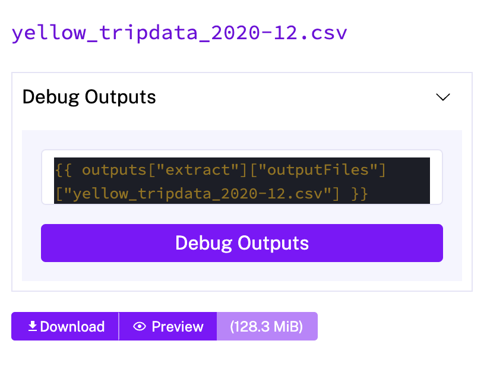

### HomeWork Week #2

- QUESTION #1

used kestra/postgres_taxi.yaml file in Kestra, commented purge_files Task...

*id: purge_files* 
*type: io.kestra.plugin.core.storage.PurgeCurrentExecutionFiles* 
*description: This will remove output files. If you'd like to explore Kestra outputs, disable it.*

...and ran yellow_tripdata_2020-12 CSV loading

> ANSWER: 128.3 MB

--------------------

- QUESTION #2

Here's where I hope the answer is right.

> ANSWER: green_tripdata_2020-04.csv

--------------------

- QUESTION #3

  `SELECT count(*) FROM public.yellow_tripdata where filename like 'yellow_tripdata_2020%'`

> ANSWER: 24,648,499

--------------------

- QUESTION #4

  `SELECT count(*) FROM public.green_tripdata where filename like 'green_tripdata_2020%'`

> ANSWER: 1,734,051

--------------------

- QUESTION #5

added in kestra/postgres_taxi.yaml file in Kestra, 2021 year and ran 2021-03-yellow

*id: year* 
*type: SELECT* 
*displayName: Select year* 
*values: ["2019", "2020", "2021"]* 
*defaults: "2019"*

    SELECT count(*) FROM public.yellow_tripdata
    where filename = 'yellow_tripdata_2021-03.csv'

> ANSWER: 1,925,152

--------------------

- QUESTION #6

checked documentation

*triggers:* 
  *- id: daily* 
    *type: io.kestra.plugin.core.trigger.Schedule* 
    *cron: "@daily"* 
    *timezone: America/New_York*

> ANSWER: Add a timezone property set to America/New_York in the Schedule trigger configuration

--------------------

